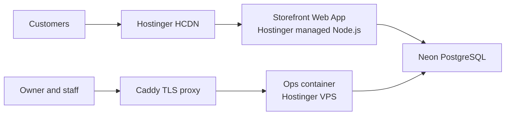

# Perfume Aura

Perfume Aura is a pnpm monorepo with two web applications backed by one Neon
PostgreSQL database:

- `perfumeaura.com` — public brand and discovery storefront on a Hostinger
  Node.js Web App. Online catalog publication and checkout are not open.
- `app.perfumeaura.com` — private owner/staff operations in a hardened
  container on a Hostinger VPS behind Caddy.

Storefront customer auth and operations auth are separate. Sellable catalog
publication, checkout, customer auth, inquiries, and staff 2FA/invites remain
disabled until their release gates pass. Seven discovery URLs are already
indexable; shop/product pages stay `noindex`.



## Start here

1. Read [the current state](docs/CURRENT_STATE.md).
2. Open only the owning document for the task.
3. Follow [the repository rules](AGENTS.md) before changing code or production.

| Need | Owner |
|---|---|
| Live topology, exact releases, locks, next actions | [CURRENT_STATE.md](docs/CURRENT_STATE.md) |
| Commerce launch blockers B01–B07 | [Launch gates](docs/COMMERCE.md#launch-gates) |
| Users, routes, live vs locked behavior | [Product behavior](docs/COMMERCE.md#product-behavior) |
| Code, stack, data, tests, CI | [ENGINEERING.md](docs/ENGINEERING.md) |
| Hostinger, VPS, DNS, Neon, deploy, recovery | [OPERATIONS.md](docs/OPERATIONS.md) |
| Commerce requirements, ADRs, checklist | [COMMERCE.md](docs/COMMERCE.md) |
| Catalog mappings, legal research, design evidence | [REFERENCE.md](docs/REFERENCE.md) |
| Agent invariants and finish gates | [AGENTS.md](AGENTS.md) |

## Local setup

Storefront production selects Hostinger-managed Node `24.x`; repository
tooling, CI, ops image, and both packers pin Node `24.6.0`. Use disposable
loopback PostgreSQL for integration tests.

```bash
nvm use
corepack enable
pnpm install --frozen-lockfile
pnpm check
```

Environment templates live in each application. Never commit credentials or
connection strings.

## Commands

```bash
pnpm dev:storefront
pnpm dev:ops
pnpm check
PERFUME_AURA_TEST_DB_URL='<migrated-disposable-loopback-url>'
TEST_DATABASE_URL="$PERFUME_AURA_TEST_DB_URL" \
  DATABASE_URL="$PERFUME_AURA_TEST_DB_URL" \
  DATABASE_URL_DIRECT="$PERFUME_AURA_TEST_DB_URL" \
  pnpm test:integration
pnpm hostinger:build:storefront # Linux/Hostinger source build only
pnpm ops:pack
node scripts/verify-production-deploy.mjs <40-character-sha> \
  --target ops \
  --public-surface storefront \
  --public-base https://perfumeaura.com \
  --timeout-ms 1200000
```

See [engineering](docs/ENGINEERING.md) for repository structure and tests and
[operations](docs/OPERATIONS.md) for deployment and recovery.
