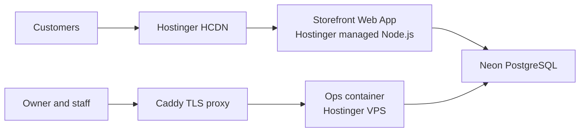

# Perfume Aura

Perfume Aura is a pnpm monorepo with two web applications backed by one Neon
PostgreSQL database:

- `perfumeaura.com` — public, release-gated storefront on a Hostinger-managed
  Node.js Web App.
- `app.perfumeaura.com` — private owner/staff operations in a hardened container
  on a Hostinger VPS behind Caddy.

Storefront customer auth and operations auth are separate. Public catalog,
checkout, customer auth, inquiries, and indexing remain disabled until their
release gates pass.



## Start here

1. Read [the current state](docs/CURRENT_STATE.md).
2. Open only the owning document for the task.
3. Follow [the repository rules](AGENTS.md) before changing code or production.

| Need | Owner |
|---|---|
| Live topology, exact releases, blockers, rollback, next actions | [CURRENT_STATE.md](docs/CURRENT_STATE.md) |
| Dependency-ordered commerce launch blocker tracker | [BLOCKERS.md](docs/BLOCKERS.md) |
| Users, routes, behavior, release locks | [PRODUCT.md](docs/PRODUCT.md) |
| Code, stack, data, tests, CI, performance, telemetry privacy | [ENGINEERING.md](docs/ENGINEERING.md) |
| Hostinger, VPS, DNS, Neon, deploy, recovery | [OPERATIONS.md](docs/OPERATIONS.md) |
| Commerce requirements, ADRs, release checklist | [COMMERCE.md](docs/COMMERCE.md) |
| Catalog mappings, legal research, design and QA evidence | [REFERENCE.md](docs/REFERENCE.md) |
| Pending domain outcomes | [Product](docs/PRODUCT.md#pending-outcome), [Engineering](docs/ENGINEERING.md#pending-outcome), [Operations](docs/OPERATIONS.md#pending-outcome) |
| Agent invariants and finish gates | [AGENTS.md](AGENTS.md) |

## Local setup

Storefront production selects Hostinger-managed Node `24.x`; repository tooling,
CI, ops image, and both packers use the pinned Node 24 compatibility baseline.
Use disposable loopback PostgreSQL for integration tests.

```bash
nvm use
corepack enable
pnpm install --frozen-lockfile
pnpm check
```

Environment templates live in each application. Never commit credentials or
connection strings.

## Commands

```bash
pnpm dev:storefront
pnpm dev:ops
pnpm check
TEST_DATABASE_URL='<migrated-disposable-loopback-url>' pnpm test:integration
pnpm storefront:pack
pnpm ops:pack
node scripts/verify-production-deploy.mjs <40-character-sha> \
  --target ops \
  --public-surface storefront \
  --public-base https://perfumeaura.com \
  --timeout-ms 1200000
```

See [engineering](docs/ENGINEERING.md) for repository structure and tests,
[operations](docs/OPERATIONS.md) for deployment and recovery, and
[historical evidence](docs/REFERENCE.md#historical-evidence) for dated
storefront and performance attestations.
