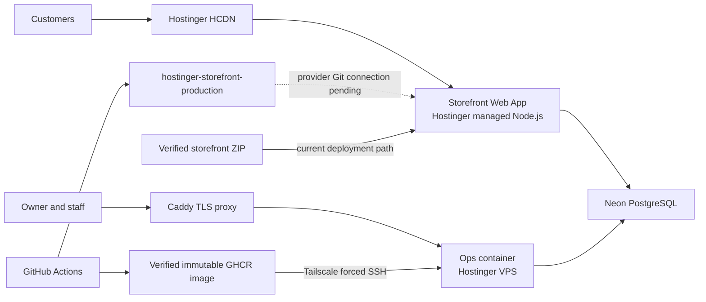

# Documentation

Read [CURRENT_STATE.md](CURRENT_STATE.md) first. Then open only the document
that owns the task:

| Document | Scope |
|---|---|
| [PRODUCT.md](PRODUCT.md) | Users, behavior, routes, and release locks |
| [ENGINEERING.md](ENGINEERING.md) | Code, data contracts, local work, tests, and CI |
| [OPERATIONS.md](OPERATIONS.md) | Hostinger, DNS, Neon, deployment, and recovery |
| [ROADMAP.md](ROADMAP.md) | Remaining work in execution order |
| [STACK.md](STACK.md) | Locked versions and tooling |
| [OPTIMIZATION.md](OPTIMIZATION.md) | Performance measurement and regression policy |
| [OBSERVABILITY.md](OBSERVABILITY.md) | PostHog/Sentry privacy, activation, and verification |
| [STAFF_OPERATIONS_RELEASE_SMOKE.md](STAFF_OPERATIONS_RELEASE_SMOKE.md) | Staff release acceptance checklist |
| [commerce/](commerce/) | Executable commerce requirements and evidence records |

`CURRENT_STATE.md` owns the live handoff. Do not duplicate its incident status
or deployed SHA in other documents.

## Production at a glance

Storefront and ops share data infrastructure but retain separate authentication,
secret, cookie, origin, release, and recovery boundaries. See `OPERATIONS.md`
for mutations and `ENGINEERING.md` for code and CI ownership.
