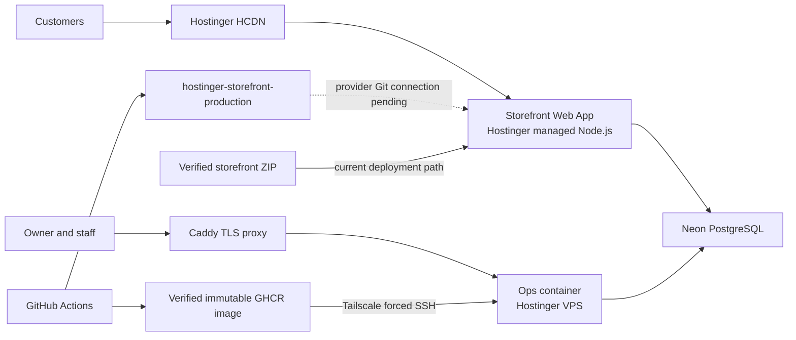

# Documentation

Start with [CURRENT_STATE.md](CURRENT_STATE.md). It alone owns live production
state, exact deployed sources, rollback windows, active risks, and next actions.
Fresh repository, provider, database, DNS, endpoint, and browser evidence outranks
all documentation.

## Task map

Open only the owner needed for the task:

| Need | Canonical owner |
|---|---|
| Users, routes, behavior, release locks | [PRODUCT.md](PRODUCT.md) |
| Code, data contracts, local work, tests, CI | [ENGINEERING.md](ENGINEERING.md) |
| Hostinger, VPS, DNS, Neon, deployment, recovery | [OPERATIONS.md](OPERATIONS.md) |
| Pending work and execution order | [ROADMAP.md](ROADMAP.md) |
| Locked versions, services, tooling | [STACK.md](STACK.md) |
| Performance policy and budgets | [OPTIMIZATION.md](OPTIMIZATION.md) |
| PostHog, Sentry, privacy, activation | [OBSERVABILITY.md](OBSERVABILITY.md) |
| Commerce requirements and evidence | [commerce/README.md](commerce/README.md) |
| Storefront design contract | [commerce/STOREFRONT-REFERENCE.md](commerce/STOREFRONT-REFERENCE.md) |
| Staff security release procedure | [runbooks/STAFF_OPERATIONS_RELEASE.md](runbooks/STAFF_OPERATIONS_RELEASE.md) |
| Recorded storefront design acceptance | [../design-qa.md](../design-qa.md) |

## Folder map

```text
docs/
  commerce/   executable commerce specification and records
  runbooks/   ordered operational acceptance procedures
  evidence/   dated historical attestations; never current state
```

Canonical files stay at `docs/` root and are indexed in task map above.

Dated evidence preserves provenance but does not describe current production.
Optimization attestations live under
[evidence/optimization/](evidence/optimization/). Generated analyzers,
screenshots, traces, and Graphify output remain untracked local artifacts.

## Production at a glance



Storefront and ops share data infrastructure but retain separate authentication,
secret, cookie, origin, release, and recovery boundaries. Operational detail
belongs in [OPERATIONS.md](OPERATIONS.md); code and CI detail belongs in
[ENGINEERING.md](ENGINEERING.md).
